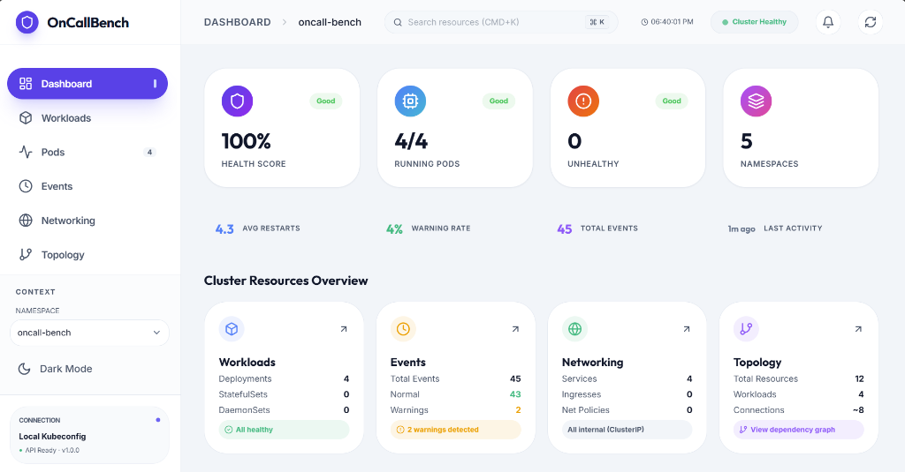
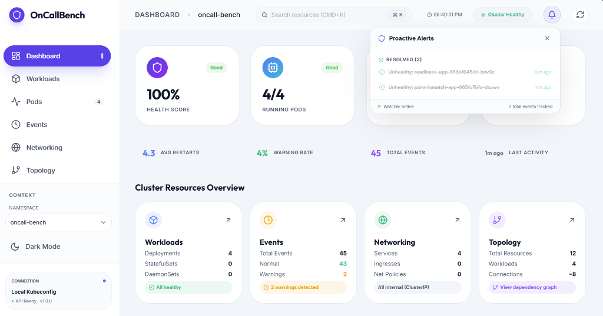
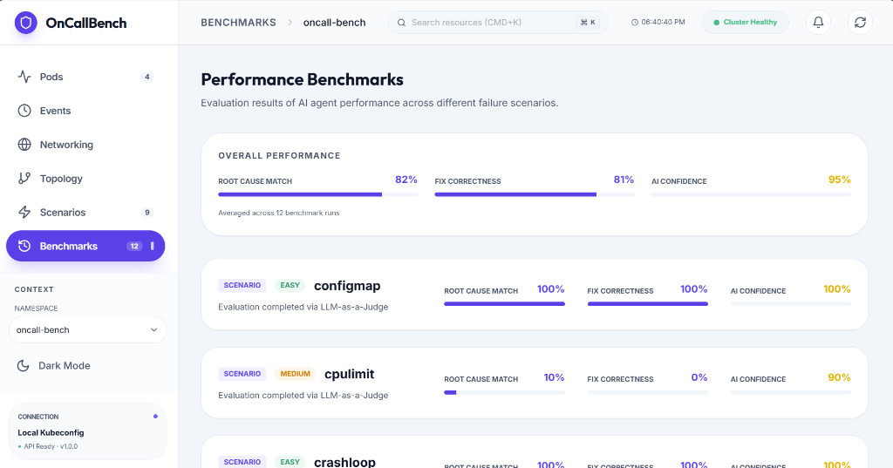
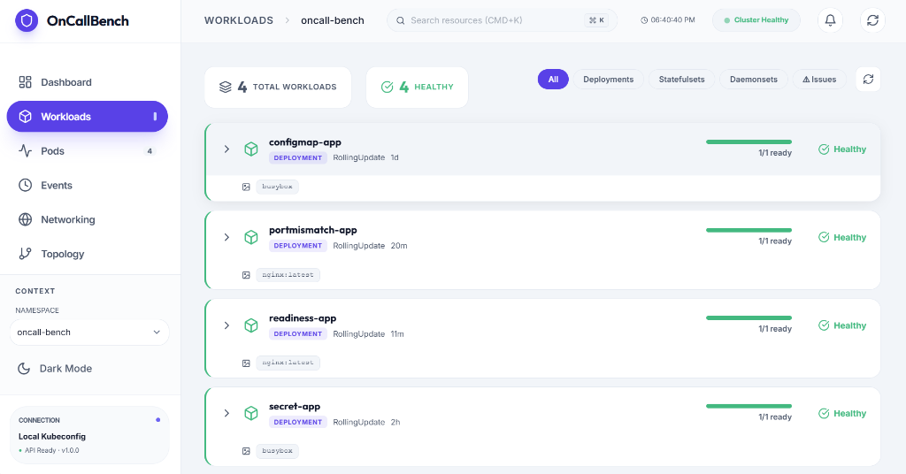
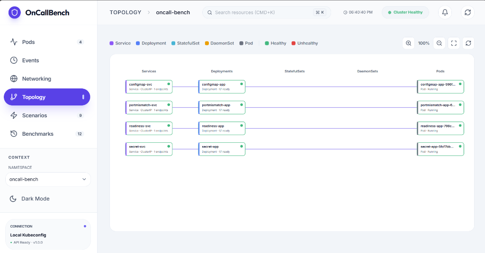

# OnCallBench

**AI SRE agent that connects directly to your Kubernetes cluster, diagnoses issues, and fixes them.**

Instead of copying logs into ChatGPT, OnCallBench gives the AI direct access to your cluster through kubectl, log search, resource inspection, and health checks. It investigates multi-step, traces owner chains, and generates fixes you can apply in one click. If the fix fails, it reads the error and tries again.

It also watches your cluster in the background and catches problems before you do.

[](https://python.org)
[](https://kubernetes.io)
[](https://ai.google.dev)
[](./LICENSE)



---

## What it does

**Proactive monitoring** — background thread watches K8s events across all namespaces. CrashLoops, OOMKills, failed probes, scheduling failures show up as alerts. Auto-resolves when pods recover (including when deployments are patched and the old pod is replaced).



**AI diagnosis** — click any pod, the agent runs a multi-turn investigation using Gemini 3.1 Pro with 6 tools:
- `run_kubectl` — safe subset of kubectl commands
- `search_logs` — filtered log search across containers
- `investigate_resource` — deep YAML inspection of any resource
- `cluster_wide_health` — overall cluster status
- `check_metrics` — CPU/memory usage
- `list_namespace_resources` — enumerate resources in a namespace

It traces Pod → ReplicaSet → Deployment, checks related Services and NetworkPolicies, and outputs structured JSON: root cause, symptoms, fix steps, confidence, risk level.

**One-click fixes** — generates kubectl commands. You click apply. If it fails, the error goes back to the AI for a corrected command automatically.

**Benchmarking** — inject failure scenarios, let the AI diagnose, score it against ground truth using LLM-as-a-Judge. Track accuracy over time.



---

## The dashboard

8 tabs: Dashboard, Workloads, Pods, Events, Networking, Topology, Scenarios, Benchmarks.



Topology view maps Service → Deployment → Pod relationships:



Dark mode, global search (Cmd+K), auto-refresh, keyboard shortcuts.

---

## Failure scenarios

9 built-in scenarios, each with a Kubernetes manifest and ground truth for scoring:

| Scenario | Category | What happens |
|----------|----------|-------------|
| CrashLoopBackOff | Container | Bad command exits immediately |
| OOMKilled | Resources | Container exceeds 64Mi memory limit |
| ImagePullBackOff | Container | Nonexistent image tag |
| Missing ConfigMap | Config | Pod references a ConfigMap that doesn't exist |
| Missing Secret | Config | Pod references a Secret that doesn't exist |
| Readiness probe failure | Health | Probe hits wrong path, pod stays NotReady |
| Liveness probe failure | Health | Probe misconfigured, pod restart loops |
| Pending (resources) | Scheduling | Requests 8 CPU / 32Gi, can't schedule |
| Port mismatch | Networking | Service targetPort ≠ container port |

---

## How the agent works

Not just "read logs and guess." It runs a loop:

1. Gathers pod status, events, logs, container states
2. Follows the owner chain — Pod → ReplicaSet → Deployment
3. Checks related resources (Services, ConfigMaps, NetworkPolicies)
4. Forms a hypothesis, runs kubectl to verify
5. Generates a fix targeting the parent controller (not the pod)
6. Fix uses `kubectl patch` with `--patch-file` for reliability
7. Verification uses label selectors, not stale pod names

Safety: commands go through an allowlist. `delete`, `drain`, `cordon`, `taint` are blocked. Patches create temp files and clean up after.

---

## Setup

### You need
- A Kubernetes cluster (Minikube, EKS, GKE, whatever)
- A [Gemini API key](https://aistudio.google.com/apikey) (free tier works)
- Python 3.10+, Node 18+

### Run locally

```bash
git clone https://github.com/YOUR_USERNAME/OnCallBench.git
cd OnCallBench

# Backend
python -m venv venv
source venv/bin/activate  # Windows: venv\Scripts\activate
pip install -r requirements.txt
cp .env.example .env      # add your GOOGLE_API_KEY
python src/api.py

# Frontend (separate terminal)
cd gui && npm install && npm run dev
```

Open http://localhost:5173

### Deploy in-cluster

```bash
# Build images
docker build -t oncall-backend:latest .
docker build -t oncall-frontend:latest ./gui

# Minikube: load images
minikube image load oncall-backend:latest
minikube image load oncall-frontend:latest

# Set API key and deploy
# Edit k8s/deploy.yaml or create the secret separately:
kubectl create secret generic oncall-secrets \
  --from-literal=GOOGLE_API_KEY="your-key" \
  -n oncall-bench --dry-run=client -o yaml | kubectl apply -f -

kubectl apply -f k8s/deploy.yaml
minikube service oncall-frontend -n oncall-system
```

---

## Project structure

```
src/
  api.py              # FastAPI backend
  agent.py            # Gemini agent with tool-calling
  event_watcher.py    # Background anomaly detection
  k8s_service.py      # All K8s API interactions
  evaluator.py        # LLM-as-a-Judge scoring
  injector.py         # Scenario injection
  utils.py            # JSON repair, command prep
  prompt_templates/
    k8s_system_prompt.txt

gui/src/
  App.jsx             # Main app
  components/
    AlertPanel.jsx    # Proactive alert bell
    WorkloadsTab.jsx
    EventsTab.jsx
    NetworkingTab.jsx
    TopologyTab.jsx
    ChatPanel.jsx     # AI chat (not exposed yet)

scenarios/            # 9 failure scenarios + ground truth
k8s/deploy.yaml       # Full K8s deployment manifest
```

## Tech stack

| | |
|---|---|
| Frontend | React 18, Vite, Tailwind, Framer Motion |
| Backend | FastAPI, Kubernetes Python Client |
| AI | Gemini, multi-turn tool calling |
| Scoring | LLM-as-a-Judge evaluation |
| Monitoring | K8s Watch API |

---

## Contributing

Contributions are welcome! Whether it's a bug fix, new scenario, UI improvement, or documentation update — we appreciate it.

### How to contribute

**1. Create an issue**

Before writing any code, [open an issue](../../issues/new) describing what you want to change or add. This lets us discuss the approach and avoid duplicate work. Include:
- A clear title and description
- Steps to reproduce (for bugs)
- Expected vs. actual behavior (for bugs)
- Your proposed approach (for features)

**2. Fork the repository**

Click the **Fork** button at the top-right of this repo to create your own copy.

```bash
# Clone your fork
git clone https://github.com/YOUR_USERNAME/OnCallBench.git
cd OnCallBench

# Add the upstream remote
git remote add upstream https://github.com/ORIGINAL_OWNER/OnCallBench.git
```

**3. Create a branch**

Always branch off of `main`. Use a descriptive branch name that references the issue number:

```bash
git checkout main
git pull upstream main
git checkout -b fix/issue-42-crashloop-scoring
```

Branch naming conventions:
| Prefix | Use case |
|--------|----------|
| `feat/` | New features |
| `fix/` | Bug fixes |
| `docs/` | Documentation changes |
| `test/` | Adding or updating tests |
| `refactor/` | Code refactoring |

**4. Make your changes**

- Follow the existing code style and project structure
- Test your changes locally (both backend and frontend if applicable)
- Keep commits focused and write clear commit messages

```bash
git add .
git commit -m "fix: correct scoring logic for CrashLoop scenario (#42)"
```

**5. Submit a pull request**

Push your branch and open a PR against `main`:

```bash
git push origin fix/issue-42-crashloop-scoring
```

Then go to your fork on GitHub and click **"Compare & pull request"**. In the PR description:
- Reference the issue (e.g., `Closes #42`)
- Describe what you changed and why
- Include screenshots for UI changes
- Note any testing you did

### Code style

- **Python** — follow PEP 8, use type hints where possible
- **JavaScript/React** — use functional components with hooks
- **Commits** — use [Conventional Commits](https://www.conventionalcommits.org/) format (`feat:`, `fix:`, `docs:`, etc.)

### First time contributing?

Look for issues labeled **`good first issue`** — these are beginner-friendly and a great way to get started.

---

## What's next

- [ ] Slack / PagerDuty webhook integration
- [ ] Incident history (persist past diagnoses)
- [ ] AI chat interface (built, not exposed yet)
- [ ] Multi-cluster support
- [ ] Predictive warnings from resource trends

---

MIT License. Built for on-call engineers.
